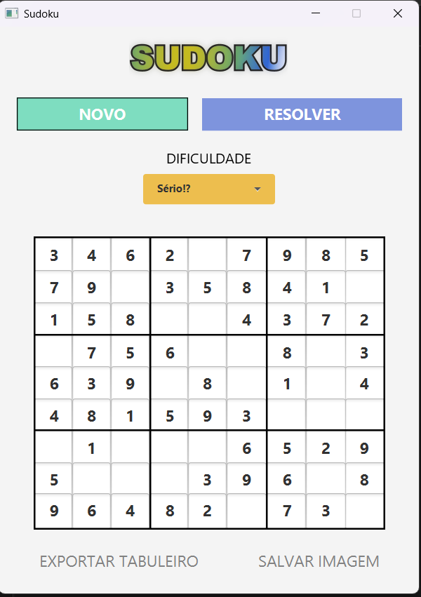
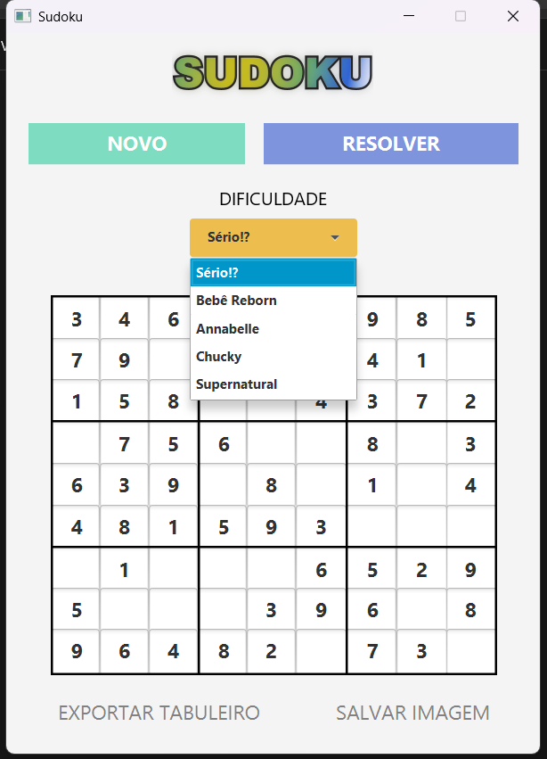
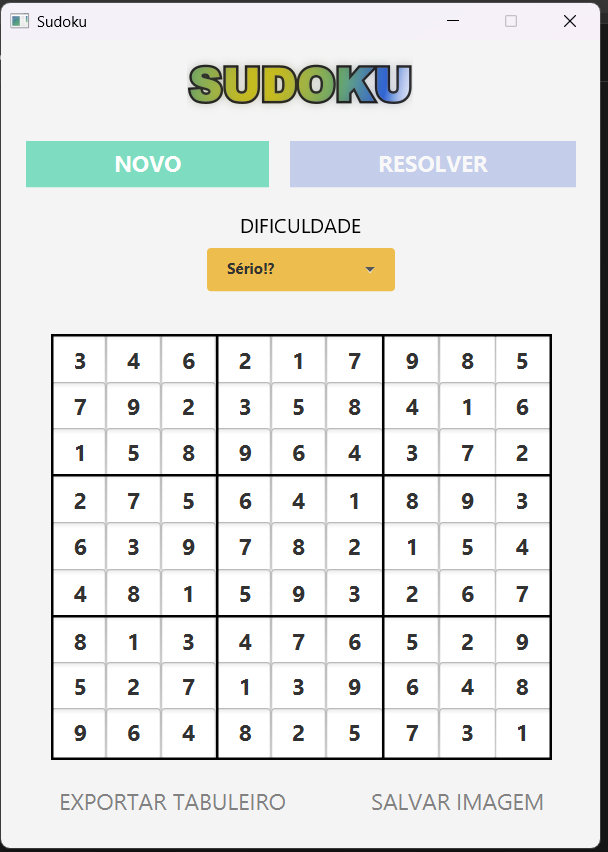
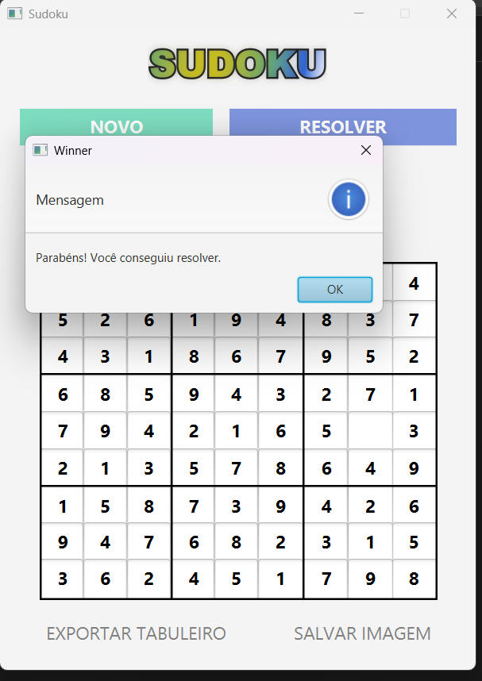
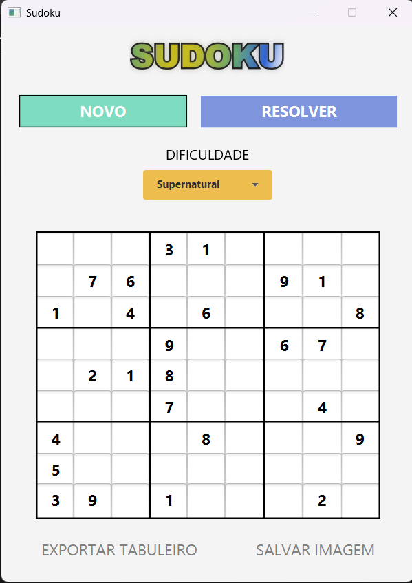
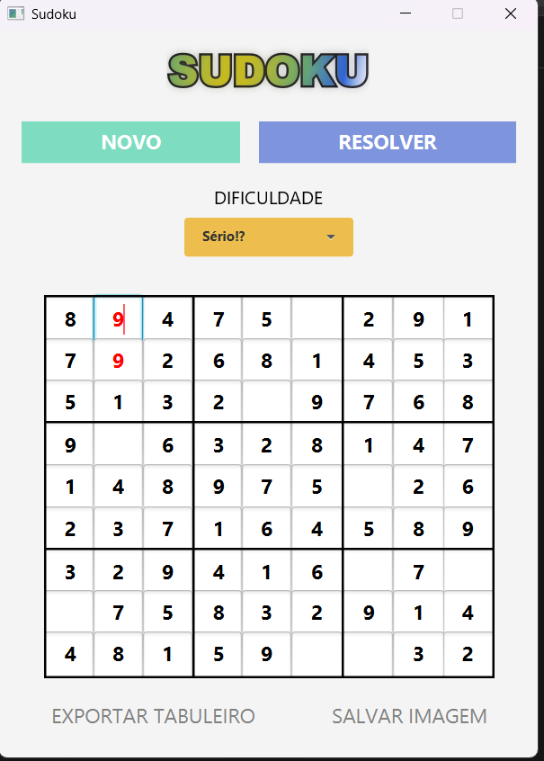
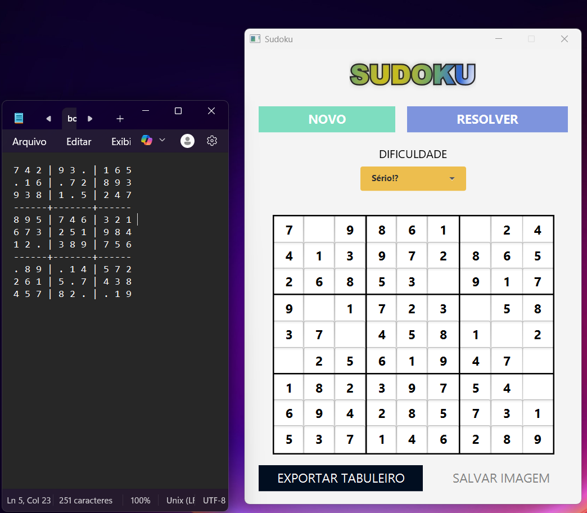
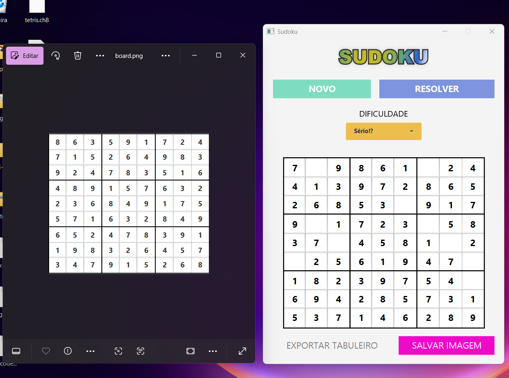

# Sudoku

Um jogo de Sudoku desenvolvido em Java, utilizando JavaFX com FXML, arquitetura MVVM e uma implementação personalizada de geração e resolução de tabuleiros.

---

## 🛠️ Tecnologias utilizadas

- **Java 17+**
- **JavaFX**
- **Gradle Kotlin DSL**
- **FXML** para layout da interface
- **Arquitetura MVVM** para separação de responsabilidades

---

## 🎮 Funcionalidades

- Geração de tabuleiros de Sudoku válidos
- Resolução automática via algoritmo de backtracking
- Interface interativa em JavaFX
- Suporte a níveis de dificuldade (`Difficulty.java`)
- Ligação entre interface e lógica via `ViewModel` com propriedades observáveis

---

## 📂 Estrutura do Projeto

```text
src/
└── main/
    ├── java/
    │   └── dev/swell/sudoku/
    │       ├── HelloApplication.java        # Entry point do app
    │       ├── HelloController.java         # Controller FXML
    │       ├── Sudoku.java                  # Lógica geral do jogo
    │       ├── SudokuViewModel.java         # ViewModel (MVVM)
    │       └── core/
    │           ├── Difficulty.java          # Enum para níveis
    │           ├── Position.java            # Representação de célula
    │           ├── Sudokable.java           # Interface comum
    │           ├── SudokuGenerator.java     # Geração com solução única
    │           ├── SudokuPuzzleBuilder.java # Builder de puzzles
    │           ├── SudokuSolver.java        # Algoritmo de solução
    │           └── SudokuState.java         # Estado do jogo
    └── resources/
        └── dev/swell/sudoku/
            ├── hello-view.fxml              # Interface gráfica
            └── style.css                    # Estilo visual
```

---

## ▶️ Como executar

1. **Pré-requisitos**:
   - Java 17 ou superior
   - Gradle instalado (ou use o `gradlew` incluído)

2. **Rodar pela linha de comando:**
   ```bash
   ./gradlew run
   ```

3. **Ou abrir no IntelliJ/Eclipse/VS Code**:
   - Importe como projeto Gradle
   - Execute `HelloApplication.java`

---

## 🧠 Arquitetura

O projeto segue o padrão **MVVM**:

- `View`: definida em FXML (`hello-view.fxml`)
- `ViewModel`: `SudokuViewModel.java`, encapsula lógica de apresentação
- `Model`: classes em `core/`, responsáveis pela geração, solução e estado do Sudoku

---
## 📸 Screenshot 



*Figura 1: Interface padrão do jogo*



*Figura 2: Níveis de dificuldade*



*Figura 3: Tabuleiro resolvido através do clique no botão resolver*



*Figura 4: Evento final quando o jogador ganha*



*Figura 5: Tabuleiro mostrando outro nível de dificuldade*



*Figura 6: Tabuleiro mostrando uma jogada inválida*



*Figura 7: Evento de exportar o tabuleiro para um arquivo de texto*



*Figura 8: Evento de exportar o tabuleiro como imagem*


